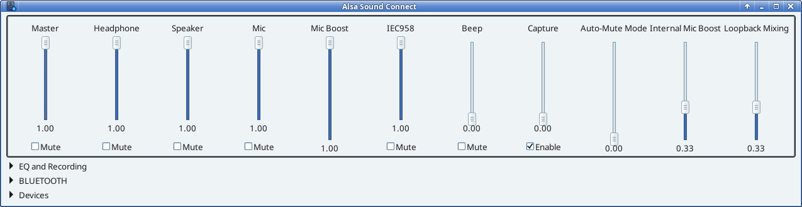

# jack-bridge - System-wide ALSA + JACK Audio with GUI



**jack-bridge** provides a complete, lightweight audio stack for Debian-based Linux systems using JACK and ALSA — without systemd, PulseAudio, or PipeWire. Perfect for users who want minimal dependencies and maximum control.

## Features

### Alsa Sound Connect GUI - Original mixer and eq GUI by mrgreenjeans **AlsaTune GUI** ([SourceForge](https://sourceforge.net/projects/vuu-do/files/Miscellaneous/apps/AlsaTune/))

Professional audio control interface (`mxeq`) with:
- **Dynamic mixer controls** - Automatically shows hardware controls for active device (Internal/USB/HDMI/BLUETOOTH)
- **10-band equalizer** with real-time adjustments and preset management
- **Built-in recorder** - Record in mono/stereo at 44.1kHz or 48kHz, saves to ~/Music
- **Bluetooth panel** - Scan, pair, trust, connect devices with visual feedback
- **Device switching** - Change output between Internal/USB/HDMI/Bluetooth without restarting JACK

### 🔊 Audio Routing
- **ALSA → EQ → JACK pipeline** - All ALSA apps benefit from EQ without affecting native JACK clients
- **Multi-device support** - Seamlessly switch between internal, USB, HDMI, and Bluetooth outputs
- **Persistent bridge ports** - USB/HDMI ports available at boot (Bluetooth spawned on-demand)
- **Capture-aware** - Records from JACK's `system:capture` `system:midi_capture` ports and custom `usb_in:capture` for external audio interface.
- **Qjackctl Graph** - Visually route audio to and from multiple apps and sources using graph in qjackctl. 

### 🎵 Bluetooth Audio Integration
- **BlueZ + BlueALSA** - Full A2DP/HFP/HSP support without PulseAudio/PipeWire
- **GUI controls** - Scan, pair, trust, connect, and remove devices
- **On-demand spawning** - Bluetooth ports created only when needed (prevents boot errors)
- **Device state tracking** - Buttons auto-enable based on connection status

### ⚙️ System Integration
- **SysV init scripts** - Clean startup/shutdown (no systemd required)
- **Graceful shutdown** - Daemons stop cleanly on reboot/shutdown (no warnings)
- **Auto-detection** - Finds audio devices, detects users automatically
- **Non-root operation** - GUI runs as regular user with polkit for Bluetooth

## Requirements

**Debian-based distributions** (Devuan, Debian, Ubuntu, Linux Mint, etc.)

**Recommended:** Remove PulseAudio and PipeWire before installation to avoid conflicts.

## Installation

### Quick Install

```bash
# Clone repository
git clone https://github.com/rations/jack-bridge.git

cd jack-bridge

# Update 
sudo apt update

# Run installer
sudo sh contrib/install.sh

# Reboot to activate
sudo reboot
```

### What Gets Installed

The installer will:
1. Install required packages (jackd, alsa-utils, bluez, etc.)
2. Configure ALSA → EQ → JACK routing
3. Install SysV init scripts for jackd-rt, bluealsad, bluetoothd, jack-bridge-ports
4. Install Alsa Sound Connect GUI to `/usr/local/bin/mxeq`
5. Create desktop launcher (Applications → Sound & Video → Alsa Sound Connect)
6. Set up Bluetooth D-Bus policies and polkit rules
7. Configure audio group permissions

After reboot, launch **Alsa Sound Connect** from your applications menu.

## Usage

### First Launch

1. Open **Alsa Sound Connect** from Applications menu
2. Mixer controls for internal audio card will be visible
3. All sections (EQ, Bluetooth, Devices) are collapsed by default - expand as needed

### Mixer Controls

- **Volume sliders** - Adjust playback/capture levels
- **Mute/Enable checkboxes** - Mute playback or enable capture
- **Dynamic switching** - Controls update when you change devices

### Recording

1. Expand "EQ and Recording" section
2. Enter filename (auto-saves to ~/Music/)
3. Choose Mono/Stereo and sample rate
4. Click Record → Stop when finished

### Device Switching

1. Expand "Devices" section
2. Select Internal, USB, HDMI, or Bluetooth
3. Mixer automatically updates to show that device's controls
4. Audio routes to selected output immediately

### Bluetooth Setup

1. Expand "BLUETOOTH" section
2. Click **Scan** to discover devices
3. Select device → **Pair** → **Trust** → **Connect**
4. Click **Set as Output** to route audio through Bluetooth
5. OR use Devices panel → Bluetooth radio button

**Button Logic:**
- **Pair**: Enabled if device not paired
- **Trust**: Enabled after pairing
- **Connect**: Enabled for paired devices
- **Remove**: Removes device from system

## Bluetooth Details

### Architecture

jack-bridge integrates BlueZ (Bluetooth stack) and BlueALSA (audio bridge) into the ALSA+JACK pipeline:

Bluetooth Device ←→ bluetoothd ←→ bluealsad ←→ ALSA bluealsa plugin ←→ alsa_out ←→ JACK. Connections visible using graph in qjackctl.

### Requirements

- User must be in `audio` group (installer handles this)
- User should be in `bluetooth` group if it exists (optional, for better compatibility)
- D-Bus and polkit must be running

### On-Demand Port Spawning

Unlike USB/HDMI (which create persistent ports at boot), Bluetooth ports are spawned **on-demand** because:
- BlueALSA PCM requires an active connection
- Spawning at boot would fail if no device connected
- On-demand prevents error messages and saves resources

When you select Bluetooth output:
1. Helper checks for connected device
2. Spawns `alsa_out -j bluealsa` client
3. Creates `bluealsa:playback_1/2` JACK ports
4. Routes audio through Bluetooth

### Troubleshooting

**Discovery finds nothing:**
```bash
rfkill list                    # Check if Bluetooth blocked
sudo rfkill unblock bluetooth  # Unblock if needed
service bluetoothd status      # Ensure daemon running

**Cannot pair/connect:**
- Verify user groups: `id -nG` (should show `audio`, optionally `bluetooth`)
- Check polkit rule exists: `ls /etc/polkit-1/rules.d/90-jack-bridge-bluetooth.rules`
- Check D-Bus policy: `ls /usr/share/dbus-1/system.d/org.bluealsa.conf`

**No audio on Bluetooth:**
```bash
jack_lsp | grep bluealsa       # Verify ports exist
service bluealsad status       # Ensure daemon running
```
Re-select Bluetooth in Devices panel or run:
```bash
/usr/local/lib/jack-bridge/jack-route-select bluetooth

## Building from Source

### Quick Build (Uses Prebuilt Binaries)

The installer uses prebuilt BlueALSA binaries in `contrib/bin/`. To rebuild everything from source:

### Building BlueALSA Components

See detailed guides:
- **[BUILD_PLUGINS_GUIDE.md](contrib/BUILD_PLUGINS_GUIDE.md)** - Build matching ALSA plugins
- **[bluealsa-INSTALL.md](bluealsa-INSTALL.md)** - BlueALSA build dependencies and options
- **[blue-alsaREADME.md](blue-alsaREADME.md)** - BlueALSA project documentation

#### Quick Steps

1. **Install build dependencies:**
```bash
sudo apt install -y build-essential autoconf automake libtool pkg-config \
  git libasound2-dev libbluetooth-dev libdbus-1-dev libglib2.0-dev libsbc-dev

2. **Clone and build BlueALSA:**
```bash
cd /tmp
git clone https://github.com/Arkq/bluez-alsa.git
cd bluez-alsa
autoreconf --install --force
./configure --enable-aplay --enable-rfcomm --enable-cli
make -j$(nproc)

3. **Copy binaries to jack-bridge:**
```bash
cp utils/.libs/bluealsad ~/jack-bridge/contrib/bin/
cp utils/.libs/bluealsactl ~/jack-bridge/contrib/bin/
cp utils/.libs/bluealsa-aplay ~/jack-bridge/contrib/bin/
cp utils/.libs/bluealsa-rfcomm ~/jack-bridge/contrib/bin/
cp src/.libs/libasound_module_pcm_bluealsa.so ~/jack-bridge/contrib/bin/
cp src/.libs/libasound_module_ctl_bluealsa.so ~/jack-bridge/contrib/bin/

Recommended options for sysvinit (non-systemd) systems:
- Do NOT enable systemd unit files: do not pass --enable-systemd
- To include the RFCOMM tool: pass --enable-rfcomm
- To set a non-root runtime user (useful when running without systemd):
  ../configure --prefix=/usr/local --with-bluealsaduser=bluealsa --enable-rfcomm

Example
autoreconf --install
mkdir build && cd build
../configure --prefix=/usr/local --with-bluealsaduser=bluealsa --enable-rfcomm
make

Install (optional)
- Install to the system:
  sudo make install
- Or stage into a directory for packaging:
  sudo make DESTDIR=$(pwd)/BLUEALSA install

Per-binary minimal compile commands (useful for producing a single utility if you have the relevant source file)
- These are minimal gcc commands (assume src/ contains the single utility source and pkg-config is available):

- bluealsactl (requires GLib/GIO and D-Bus):
  gcc -Wall -Wextra -o contrib/bin/bluealsactl src/bluealsactl.c $(pkg-config --cflags --libs glib-2.0 gio-2.0 dbus-1)

- bluealsa-aplay (requires GLib/GIO, D-Bus, and ALSA):
  gcc -Wall -Wextra -o contrib/bin/bluealsa-aplay src/bluealsa-aplay.c $(pkg-config --cflags --libs glib-2.0 gio-2.0 dbus-1 alsa)

- bluealsa-rfcomm (requires GLib/GIO, D-Bus, and readline):
  gcc -Wall -Wextra -o contrib/bin/bluealsa-rfcomm src/bluealsa-rfcomm.c $(pkg-config --cflags --libs glib-2.0 gio-2.0 dbus-1) -lreadline

- bluealsad (daemon)
  - The daemon links multiple internal sources and should be built with the Autotools workflow (no supported single-file gcc command). Use the example configure+make sequence above.

### Building GUI (mxeq)

```bash
cd ~/jack-bridge
make -j


The Makefile builds `mxeq` (GUI) and `bt_agent` (Bluetooth agent helper).

## Uninstall

To completely remove jack-bridge:

```bash
cd ~/jack-bridge
sudo ./contrib/uninstall.sh

The uninstaller removes:
- All init scripts and service registrations
- Installed binaries (mxeq, BlueALSA tools)
- Configuration files (/etc/asound.conf, /etc/jack-bridge/)
- Desktop launcher
- Polkit rules and D-Bus policies
- Helper scripts

**Note:** The uninstaller does NOT remove:
- Installed packages (jackd, alsa-utils, bluez, etc.)
- User-created recordings in ~/Music/
- User-specific configs in ~/.config/jack-bridge/

To also remove packages:
```bash
sudo apt remove --purge jackd2 qjackctl bluez bluez-tools libasound2-plugins \
  alsa-utils apulse libasound2-plugin-equal swh-plugins libgtk-3-0
sudo apt autoremove

## Architecture

### Service Stack (SysV Init)
```
Boot Sequence:
├─ dbus (system)
├─ bluetoothd (BlueZ Bluetooth daemon)
├─ bluealsad (BlueALSA audio bridge)
├─ jackd-rt (JACK audio server)
└─ jack-bridge-ports (persistent USB/HDMI bridge ports)

Shutdown Sequence (reverse order with graceful termination)
```

### Audio Pipeline

```
Application (ALSA API)
    ↓
/etc/asound.conf (routing config)
    ↓
ALSA Equal Plugin (10-band EQ)
    ↓
ALSA JACK Plugin (bridge to JACK)
    ↓
JACK Audio Server (jackd)
    ├─ system:playback_1/2 (internal)
    ├─ usb_out:playback_1/2 (USB)
    ├─ hdmi_out:playback_1/2 (HDMI)
    └─ bluealsa:playback_1/2 (Bluetooth, on-demand)
    ↓
ALSA Device (hw:X)
    ↓
Audio Output
```

### File Locations

**Binaries:**
- `/usr/local/bin/mxeq` - Alsa Sound Connect GUI
- `/usr/local/bin/bluealsad` - BlueALSA daemon
- `/usr/local/bin/bluealsactl` - BlueALSA control utility
- `/usr/local/bin/bluealsa-aplay` - BlueALSA player
- `/usr/local/bin/bluealsa-rfcomm` - Bluetooth RFCOMM terminal

**Init Scripts:**
- `/etc/init.d/jackd-rt` - JACK audio server
- `/etc/init.d/bluealsad` - BlueALSA daemon
- `/etc/init.d/bluetoothd` - BlueZ Bluetooth daemon
- `/etc/init.d/jack-bridge-ports` - Persistent bridge ports

**Configuration:**
- `/etc/asound.conf` - ALSA routing and EQ configuration
- `/etc/jack-bridge/devices.conf` - Device preferences (Internal/USB/HDMI/Bluetooth)
- `/usr/share/dbus-1/system.d/org.bluealsa.conf` - BlueALSA D-Bus policy
- `/etc/polkit-1/rules.d/90-jack-bridge-bluetooth.rules` - Bluetooth permissions

**Helpers:**
- `/usr/local/lib/jack-bridge/jack-route-select` - Device routing helper
- `/usr/local/lib/jack-bridge/detect-alsa-device.sh` - Device detection
- `/usr/local/lib/jack-bridge/jack-autoconnect` - Auto-connection helper
- `/usr/local/lib/jack-bridge/jack-watchdog` - JACK monitoring

**User Data:**
- `~/.local/share/mxeq/presets.csv` - EQ presets
- `~/Music/` - Recorded audio files
- `~/.config/jack-bridge/devices.conf` - Per-user device preferences

## Credits

**jack-bridge** by [@rations](https://github.com/rations)

Built with:
- **[JACK Audio Connection Kit](https://jackaudio.org/)** - Professional audio server
- **[ALSA](https://www.alsa-project.org/)** - Linux sound architecture
- **[BlueZ](http://www.bluez.org/)** - Official Linux Bluetooth stack
- **[BlueALSA](https://github.com/Arkq/bluez-alsa)** - Bluetooth audio ALSA backend by Arkadiusz Bokowy
- **AlsaTune GUI** - Original mixer GUI by mrgreenjeans ([SourceForge](https://sourceforge.net/projects/vuu-do/files/Miscellaneous/apps/AlsaTune/))

## License

This project is open source. Individual components retain their original licenses:
- jack-bridge scripts and integration: See [LICENSE](LICENSE)
- BlueALSA: MIT License
- JACK: LGPL/GPL
- ALSA: LGPL

## Support

**Issues:** [GitHub Issues](https://github.com/rations/jack-bridge/issues)

**Documentation:**
- [BUILD_PLUGINS_GUIDE.md](contrib/BUILD_PLUGINS_GUIDE.md) - Building ALSA plugins
- [bluealsa-INSTALL.md](bluealsa-INSTALL.md) - BlueALSA installation details
- [blue-alsaREADME.md](blue-alsaREADME.md) - BlueALSA project documentation

---

**Note:** This project intentionally avoids systemd, PulseAudio, and PipeWire. It's designed for systems where a lightweight, JACK-first audio stack is desired.
